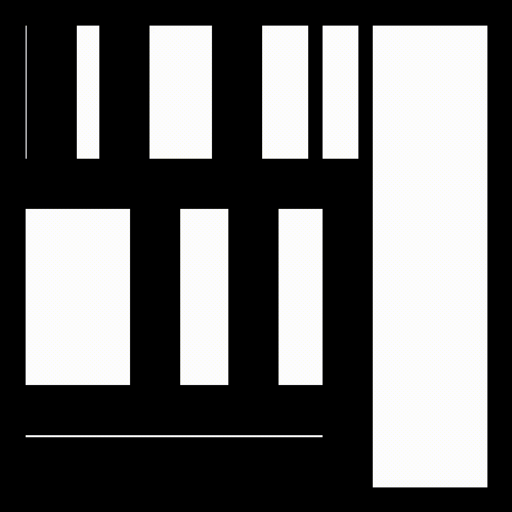
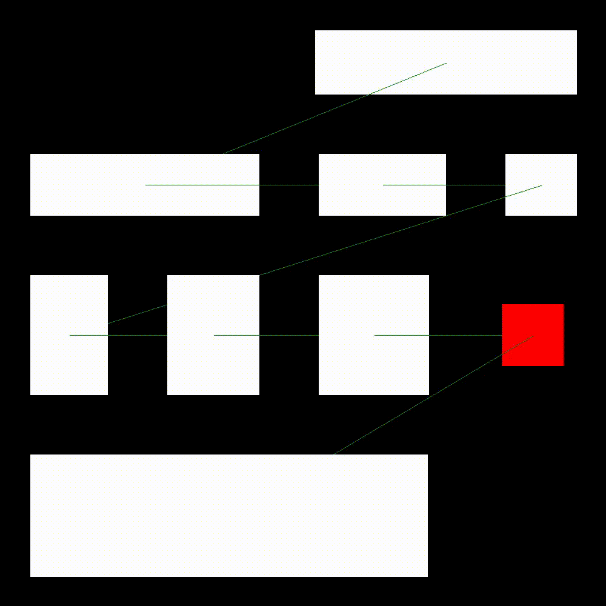

# Binary-Space-Partitioning
The visualization of the binary space partitioning algorithm used in my multiplayer video game project.

This algorithm is used to generate rooms that do not overlap. There are many many many dungeon generation algorithms that already exist but this is my own implementation of the binary space partitioning algorithm.

The reason why I chose to use this algorithm to generate the rooms of the dungeons in my game is because it is such a simple algorithm that can generate results just as nice as some other much more complicated algorithms that exist. Granted, the binary space partitioning algorithm does require some tweaking to generate nice results but is still quite efficient out of the box.

## How the algorithm works
1. Create a giant room that will take up as much space as area you want to be able to encapsulate your map
2. Select a room at random
3. Select an orientation at random for the partition to be created, horizontal or vertical.
4. Cut in the orientation that the algorithm selected, at a random distance along the room, which will split this one room into two
5. repeat step two however many times you wish

Indeed, the algorithm is very simple, but it's beauty comes from tweaking it and adding restrictions to it.

The first modification we may wish to make to the algorithm is to add a margin to the rooms which are generated, as the result of the algorithm looks like this:

Adding the margin cleans up the result and makes it look like actual rooms:

Now that we can actually see how the rooms are divided, we notice that they can be extremely thin, or tiny. Indeed, this is because there are no restrictions on the size of the rooms, so we may wish to add a limit to how small a room can get:

The result of these modifications gives us a result closer and closer to what we want, but something else we can do is delete a few rooms at random so that the space between rooms can be empty, in order to break the visible sort-of grid that is created:

This is pretty good for now. The generation of these dungeons is of course not done as we do not even have corridors to link the rooms, but since this is simply the visualization of the binary space partitioning algorithm used to generate the rooms in my main multiplayer video game project, I will not do further improvements for the dungeon generation in this project.

To make the result more understandable however, I can show how the corridors could be generated by linking the rooms with simple green lines, and give a red color to the room in which the players could start exploring.

To see how this algorithm is implemented in a real scenario, you might want to check out my [multiplayer video game project](https://github.com/catalexandre/Mutliplayer-Game-Project).
